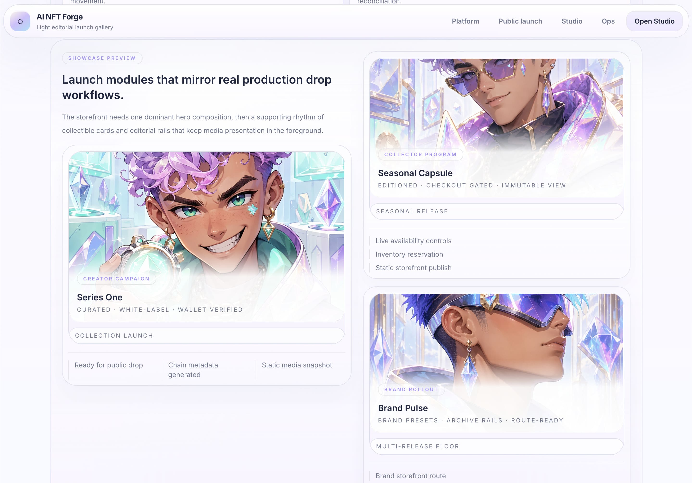
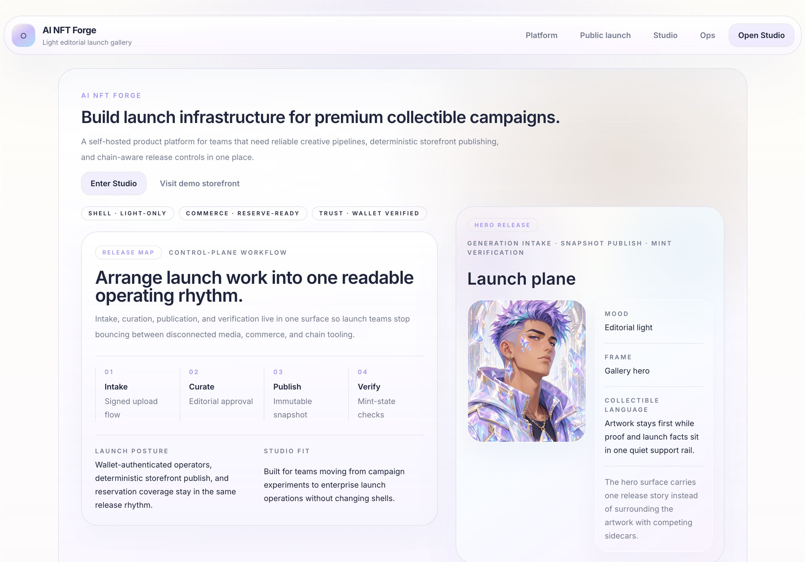
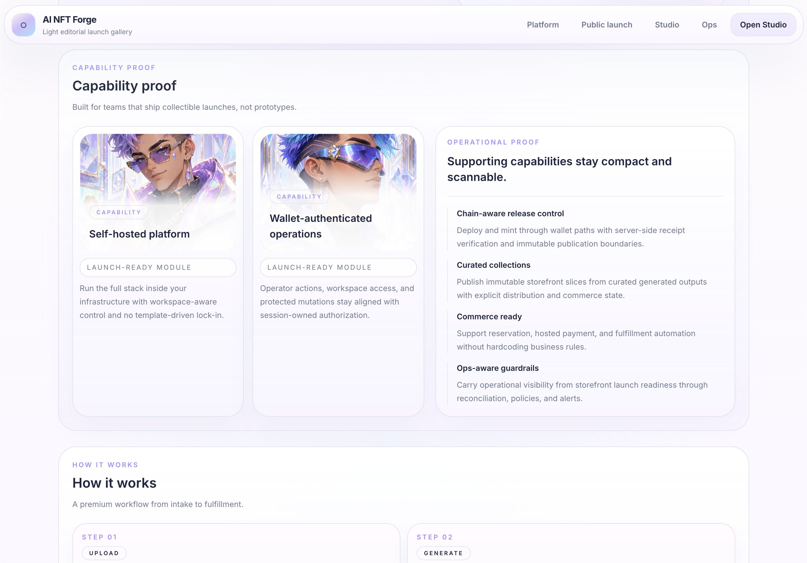
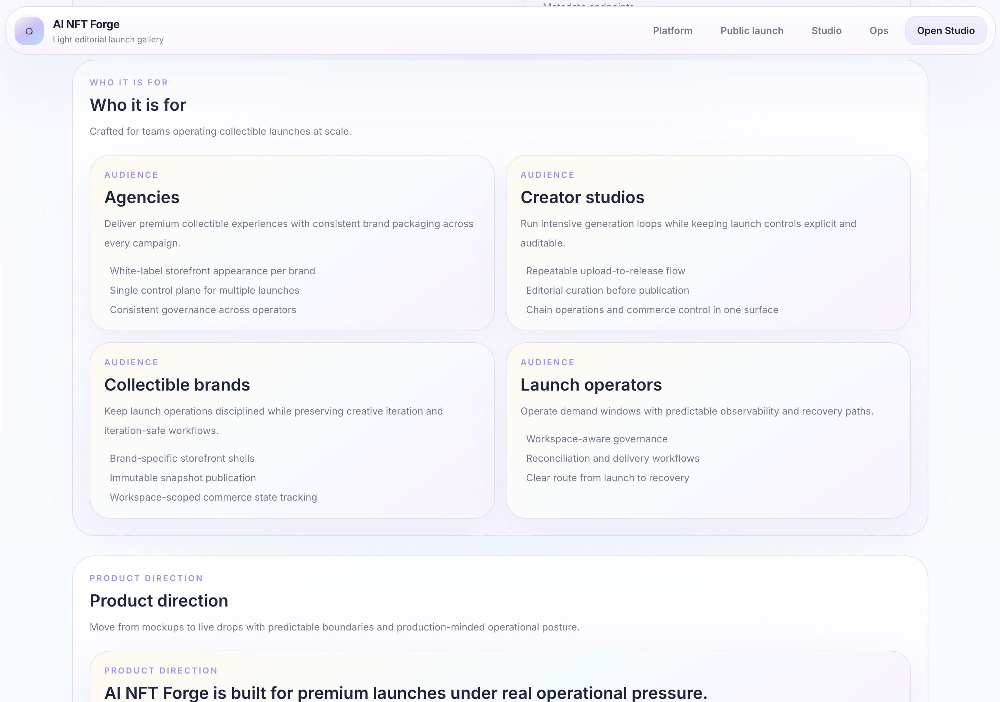

# AI NFT Forge

[](https://github.com/waqasraza123/ai-nft-forge/actions/workflows/ci.yml)
[](LICENSE)
[](package.json)
[](package.json)
[](package.json)
[](apps/web)
[](packages/database)
[](package.json)
[](infra/docker/docker-compose.yml)
[](docs/runbooks/local-development.md)
[](docs/runbooks/local-development.md)
[](docs/runbooks/local-development.md)
[](infra/docker)
[](docs/deployment/self-host-docker-compose.md)

AI NFT Forge is a self-hosted, white-label NFT launch platform for turning uploaded source media into curated AI artwork, publishing branded release pages, moderating generated outputs, and operating the system through authenticated studio and ops surfaces.

The repository ships as a pnpm monorepo with a Next.js control plane, a BullMQ worker, a standalone generation backend, PostgreSQL, Redis, and S3-compatible object storage. It is licensed under Apache-2.0.

## Screenshots






## Status

- Phases 1 through 7 are complete, and post-phase onchain deployment/minting, wallet UX, chain-state reconciliation, and commerce checkout/admin slices are landed
- Multi-workspace and multi-brand administration are landed for the current product slice
- The browser UI now runs on a Tailwind-first shared design system built around a single premium dark "Cinematic Launch OS" shell
- Deferred beyond the public release:
  - richer commerce fulfillment automation
  - advanced multi-node orchestration
- Durable project memory lives in `AGENTS.md`, `docs/project-state.md`, and the architecture docs under `docs/` including `docs/architecture/ui-design-system.md`

## What Ships

- Base Account and injected-wallet studio sign-in on top of the server-issued nonce/session contract
- Source asset intake with signed private-object uploads
- Queue-backed generation orchestration with retry and history
- Generated-asset moderation with owner/operator approve/reject/reset controls and viewer read-only review
- Collection draft curation, review-ready validation, publication, and storefront merchandising
- Public white-label brand and collection storefront routes backed only by saved brand settings and immutable published snapshots
- Contract manifest and token-URI publication routes
- Shared wallet connection UX for owner-signed contract deployment and mint flows with server-verified transaction recording for published collections
- Public item-level reservations plus hosted checkout for live published collections, with manual and Stripe provider modes
- Authenticated `/studio/commerce` administration for reservations, checkout recovery, payment confirmation, and fulfillment tracking
- Multi-workspace provisioning, workspace switching, multi-brand publication targeting, and owner/operator/viewer administration flows
- Owner-only workspace access review export plus deterministic evidence hashes and audit-backed review attestation history for governance handoff as JSON or CSV
- Authenticated ops diagnostics, persisted observability captures, alert delivery policy, and operator retry controls
- Worker-owned reconciliation with persisted runs and issues, manual run/repair/ignore actions, `/ops` visibility, and onchain drift checks for recorded deployments and mints
- Tailwind-first premium product chrome with shared public/storefront and private operator primitives
- Dockerfiles and a single-node Docker Compose self-host path

## Repository Layout

- `apps/web`: Next.js web app for marketing, studio, public storefront, auth, and `/ops`
- `apps/worker`: BullMQ worker for generation dispatch, observability capture, and reconciliation
- `apps/generation-backend`: standalone generation HTTP service
- `packages/shared`: shared schemas, env parsing, storage helpers, and reconciliation contracts
- `packages/database`: Prisma schema, repositories, and transaction helpers
- `packages/ui`: shared UI primitives
- `packages/contracts`: contract path helpers, supported chain metadata, and a server-only ERC-721 compiler entrypoint
- `infra/docker`: local and self-host Docker Compose stacks
- `docs`: product, architecture, deployment, and runbook documentation

## Quick Start

### One-command startup

```bash
pnpm app:up
```

Defaults to the attached Docker self-host stack and stops it cleanly on `Ctrl+C`.

```bash
pnpm app:up -- --mode=local
```

Starts the current local multi-process dev flow in one attached command and runs `pnpm infra:down` on `Ctrl+C`.

Explicit no-Docker cloud-backed mode:

```bash
APP_RUNTIME_MODE=cloud DATABASE_MODE=neon pnpm app:up
```

This runs local app processes only and does not call Docker or Compose. It expects hosted dependencies:

- Neon Postgres
- Upstash Redis
- Cloudflare R2

`pnpm app:up` and `pnpm app:up -- --mode=local` remain Docker-backed by default.

### Database modes

- `DATABASE_MODE=local`: default mode, uses the bundled Docker PostgreSQL service
- `DATABASE_MODE=neon`: opt-in mode, uses Neon Postgres and does not start a Docker PostgreSQL service

### Runtime modes

- `APP_RUNTIME_MODE=docker`: default mode, keeps the current Docker/Compose-backed startup path
- `APP_RUNTIME_MODE=cloud`: opt-in no-Docker mode for small dev/prototype workloads using Neon, Upstash, and R2

Use `.env.example` as the starting point. The local runbook is in [docs/runbooks/local-development.md](/Users/mc/development/blockchain/ethereum/ai-nft-forge/docs/runbooks/local-development.md), and the self-host guide is in [docs/deployment/self-host-docker-compose.md](/Users/mc/development/blockchain/ethereum/ai-nft-forge/docs/deployment/self-host-docker-compose.md).

### Local development with bundled PostgreSQL

```bash
cp .env.example .env
pnpm install
pnpm infra:config
pnpm infra:up
pnpm db:migrate:deploy
pnpm --filter @ai-nft-forge/generation-backend build
pnpm --filter @ai-nft-forge/worker build
pnpm --filter @ai-nft-forge/generation-backend start
pnpm --filter @ai-nft-forge/worker start
pnpm --filter @ai-nft-forge/web dev
```

Leave `DATABASE_MODE=local` or unset it. `pnpm infra:config` should show `postgres` in this mode.

### Local development with Neon Postgres

```bash
cp .env.example .env
pnpm install
pnpm infra:config
pnpm infra:up
pnpm prisma:validate
pnpm db:migrate:status
pnpm db:migrate:deploy
pnpm --filter @ai-nft-forge/generation-backend build
pnpm --filter @ai-nft-forge/worker build
pnpm --filter @ai-nft-forge/generation-backend start
pnpm --filter @ai-nft-forge/worker start
pnpm --filter @ai-nft-forge/web dev
```

Set these in `.env` before boot:

```env
DATABASE_MODE=neon
DATABASE_NEON_URL=postgresql://...
DATABASE_NEON_DIRECT_URL=postgresql://...
DATABASE_NEON_SHADOW_URL=postgresql://...
```

Notes:

- `DATABASE_URL` can remain in `.env`, but it is ignored while `DATABASE_MODE=neon`.
- Neon URLs should usually include `?sslmode=require`.
- `pnpm infra:config` should not show `postgres` in this mode.
- `DATABASE_NEON_SHADOW_URL` is only needed for `prisma migrate dev`.

### No-Docker cloud-backed development

```bash
cp .env.example .env
pnpm install
APP_RUNTIME_MODE=cloud DATABASE_MODE=neon pnpm prisma:validate
APP_RUNTIME_MODE=cloud DATABASE_MODE=neon pnpm db:migrate:status
APP_RUNTIME_MODE=cloud DATABASE_MODE=neon pnpm app:up
```

Set these in `.env` first:

```env
APP_RUNTIME_MODE=cloud
DATABASE_MODE=neon
DATABASE_NEON_URL=postgresql://...
DATABASE_NEON_DIRECT_URL=postgresql://...
REDIS_URL=rediss://...
S3_ENDPOINT=https://<account_id>.r2.cloudflarestorage.com
S3_REGION=auto
S3_FORCE_PATH_STYLE=false
S3_ACCESS_KEY_ID=...
S3_SECRET_ACCESS_KEY=...
S3_BUCKET_PRIVATE=...
S3_BUCKET_PUBLIC=...
S3_PUBLIC_BASE_URL=https://<public-bucket>.r2.dev
```

One-time provider setup:

- create a Neon project and copy the pooled runtime URL plus the direct Prisma URL
- create an Upstash Redis database and copy the `rediss://` URL
- create private and public Cloudflare R2 buckets plus access keys
- enable a public URL for the public bucket and set it as `S3_PUBLIC_BASE_URL`

Notes:

- cloud mode is local-process-based and does not deploy your app to hosted compute
- `DATABASE_NEON_SHADOW_URL` is only needed for `pnpm --filter @ai-nft-forge/database prisma:migrate:dev`
- `pnpm app:up -- --mode=selfhost` is not valid in cloud mode
- browser smoke and default CI remain pinned to the Docker/local path

### Single-node self-host with bundled PostgreSQL

```bash
cp .env.example .env
pnpm install
pnpm infra:selfhost:config
pnpm infra:selfhost:up
pnpm infra:selfhost:ps
```

Bundled PostgreSQL remains the default self-host mode. `pnpm infra:selfhost:config` should show `postgres`.

### Single-node self-host with Neon Postgres

```bash
cp .env.example .env
pnpm install
pnpm infra:selfhost:config
pnpm infra:selfhost:up
pnpm infra:selfhost:ps
```

Set `DATABASE_MODE=neon` and the Neon URLs in `.env` first. In this mode the self-host stack omits the PostgreSQL container and routes Prisma and runtime access to Neon.

### One-command examples

```bash
pnpm app:up
pnpm app:up -- --mode=local
DATABASE_MODE=neon pnpm app:up
DATABASE_MODE=neon pnpm app:up -- --mode=local
APP_RUNTIME_MODE=cloud DATABASE_MODE=neon pnpm app:up
```

## Validation

```bash
pnpm format-check
pnpm prisma:validate
pnpm lint
pnpm typecheck
pnpm test
pnpm build
pnpm --filter @ai-nft-forge/web exec playwright install --with-deps chromium
pnpm test:smoke
pnpm worker:health
pnpm generation-backend:health
pnpm generation-backend:ready
pnpm infra:selfhost:config
docker build -f apps/web/Dockerfile .
docker build -f apps/worker/Dockerfile .
docker build -f apps/generation-backend/Dockerfile .
```

## Detailed Commands

```
1. Local app with bundled PostgreSQL

Open 4 terminals from the repo root.

Terminal 1: backing services
cp .env.example .env
pnpm install
pnpm infra:up
pnpm db:migrate:deploy
pnpm infra:ps

Terminal 2: generation backend
pnpm --filter @ai-nft-forge/generation-backend build
pnpm --filter @ai-nft-forge/generation-backend start

Terminal 3: worker
pnpm --filter @ai-nft-forge/worker build
pnpm --filter @ai-nft-forge/worker start

Terminal 4: web
pnpm --filter @ai-nft-forge/web dev

2. Local app with Neon Postgres

Set this in .env first:

DATABASE_MODE=neon
DATABASE_NEON_URL=postgresql://...
DATABASE_NEON_DIRECT_URL=postgresql://...
DATABASE_NEON_SHADOW_URL=postgresql://...

Then run:

pnpm install
pnpm infra:config
pnpm infra:up
pnpm prisma:validate
pnpm db:migrate:status
pnpm db:migrate:deploy
pnpm --filter @ai-nft-forge/generation-backend build
pnpm --filter @ai-nft-forge/generation-backend start
pnpm --filter @ai-nft-forge/worker build
pnpm --filter @ai-nft-forge/worker start
pnpm --filter @ai-nft-forge/web dev

Expected checks:

pnpm infra:config            # no postgres service in Neon mode
pnpm worker:health
pnpm generation-backend:health
pnpm generation-backend:ready
curl http://127.0.0.1:3000/api/health

3. Health checks after boot

Run these from the repo root:
pnpm worker:health
pnpm generation-backend:health
pnpm generation-backend:ready
curl http://127.0.0.1:3000/api/health

If you want production-style web instead of dev:

pnpm --filter @ai-nft-forge/web build
pnpm --filter @ai-nft-forge/web start
4. Full repo verification

Run this from the repo root:

pnpm format-check
pnpm prisma:validate
pnpm lint
pnpm typecheck
pnpm test
pnpm build

Or use the combined command:

pnpm validate
5. Browser smoke tests

First make sure:

Docker Desktop is running
local infra is up
Playwright browser is installed

Then run:

pnpm --filter @ai-nft-forge/web exec playwright install chromium
node scripts/run-browser-smoke.mjs
6. Docker and self-host validation
pnpm infra:config
pnpm infra:selfhost:config
docker build -f apps/web/Dockerfile .
docker build -f apps/worker/Dockerfile .
docker build -f apps/generation-backend/Dockerfile .

If you want bundled PostgreSQL self-host:

pnpm infra:selfhost:up
pnpm infra:selfhost:ps
pnpm infra:selfhost:logs

If you want Neon self-host:

Set DATABASE_MODE=neon in .env, then run:

pnpm infra:selfhost:config
pnpm infra:selfhost:up
pnpm infra:selfhost:ps
pnpm infra:selfhost:logs
7. Clean shutdown

Local dev stack:

pnpm infra:down

Self-host stack:

pnpm infra:selfhost:down
8. Best practical sequence

If you want the shortest realistic “run + test everything” path, use this exact sequence:

Bundled PostgreSQL path:

pnpm install
pnpm infra:up
pnpm db:migrate:deploy
pnpm format-check
pnpm prisma:validate
pnpm lint
pnpm typecheck
pnpm test
pnpm build
pnpm worker:health
pnpm generation-backend:health
pnpm generation-backend:ready
pnpm --filter @ai-nft-forge/web exec playwright install chromium
node scripts/run-browser-smoke.mjs

Neon path:

pnpm install
pnpm infra:config
pnpm infra:up
pnpm prisma:validate
pnpm db:migrate:status
pnpm db:migrate:deploy
pnpm typecheck
pnpm test
pnpm build
pnpm worker:health
pnpm generation-backend:health
pnpm generation-backend:ready
```

## Documentation

- Project state: [docs/project-state.md](/Users/mc/development/blockchain/ethereum/ai-nft-forge/docs/project-state.md)
- Phase map: [docs/architecture/phases.md](/Users/mc/development/blockchain/ethereum/ai-nft-forge/docs/architecture/phases.md)
- Routes and jobs: [docs/architecture/routes-and-jobs.md](/Users/mc/development/blockchain/ethereum/ai-nft-forge/docs/architecture/routes-and-jobs.md)
- Workspace access control: [docs/architecture/workspace-access-control.md](/Users/mc/development/blockchain/ethereum/ai-nft-forge/docs/architecture/workspace-access-control.md)
- Service overview: [docs/deployment/service-overview.md](/Users/mc/development/blockchain/ethereum/ai-nft-forge/docs/deployment/service-overview.md)
- Environment reference: [docs/deployment/environment-reference.md](/Users/mc/development/blockchain/ethereum/ai-nft-forge/docs/deployment/environment-reference.md)
- Self-host deployment: [docs/deployment/self-host-docker-compose.md](/Users/mc/development/blockchain/ethereum/ai-nft-forge/docs/deployment/self-host-docker-compose.md)
- Local development: [docs/runbooks/local-development.md](/Users/mc/development/blockchain/ethereum/ai-nft-forge/docs/runbooks/local-development.md)
- Operator runbook: [docs/runbooks/operator-runbook.md](/Users/mc/development/blockchain/ethereum/ai-nft-forge/docs/runbooks/operator-runbook.md)
- Troubleshooting: [docs/runbooks/troubleshooting.md](/Users/mc/development/blockchain/ethereum/ai-nft-forge/docs/runbooks/troubleshooting.md)
- Release checklist: [docs/release-checklist.md](/Users/mc/development/blockchain/ethereum/ai-nft-forge/docs/release-checklist.md)

## Production Notes

- PostgreSQL is the system of record
- Source and generated assets stay private by default; public storefront assets are copied into the public bucket only at publication time
- Public routes read only from saved brand settings and immutable published snapshots
- Onchain deployment and minting stay owner-signed; the repo opens wallet flows and records verified chain receipts, but it does not ship server-held private keys
- Commerce checkout now supports `manual`, `stripe`, and `disabled` provider modes, with Stripe-hosted checkout and webhook-driven completion when configured
- Commerce administration now lives on `/studio/commerce`, with owner/operator manual completion, release/cancel controls, and fulfillment-state tracking
- Workspace viewers can inspect studio, commerce, ops, audit, retention, and directory state without mutation rights
- Workspace owners can change existing non-owner members between operator and viewer without removing or reinviting them, with role changes captured in the workspace audit log
- Workspace owners can also correct non-expired pending invitation roles before acceptance, with expired invitations preserved as immutable access history
- Workspace role-change audit rows include previous and new role metadata in studio history, `/ops/audit`, and CSV export
- Demoting or removing an operator automatically cancels that operator's pending ownership-transfer request
- This repository targets single-node self-hosting with Docker Compose, not Kubernetes or hosted SaaS

## Community

- Contribution guide: [CONTRIBUTING.md](/Users/mc/development/blockchain/ethereum/ai-nft-forge/CONTRIBUTING.md)
- Code of conduct: [CODE_OF_CONDUCT.md](/Users/mc/development/blockchain/ethereum/ai-nft-forge/CODE_OF_CONDUCT.md)
- Security policy: [SECURITY.md](/Users/mc/development/blockchain/ethereum/ai-nft-forge/SECURITY.md)
- Support policy: [SUPPORT.md](/Users/mc/development/blockchain/ethereum/ai-nft-forge/SUPPORT.md)
